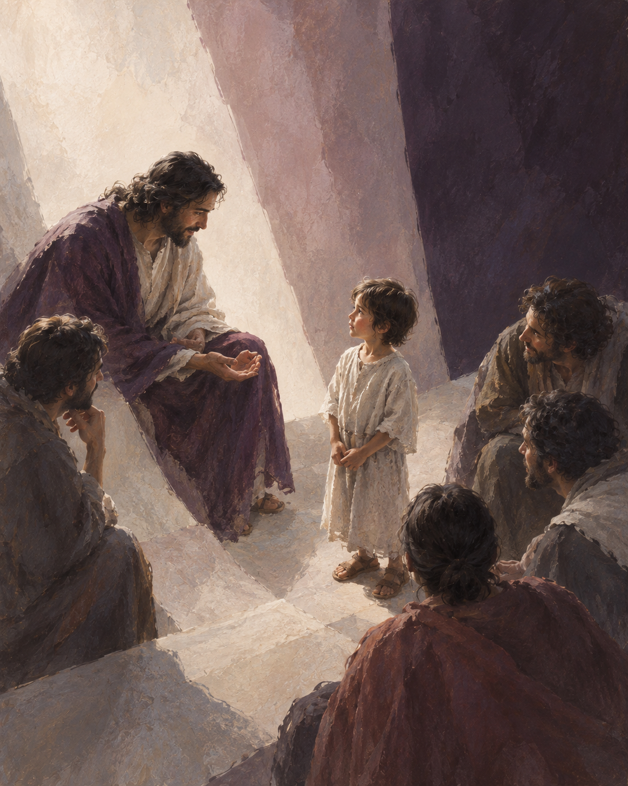
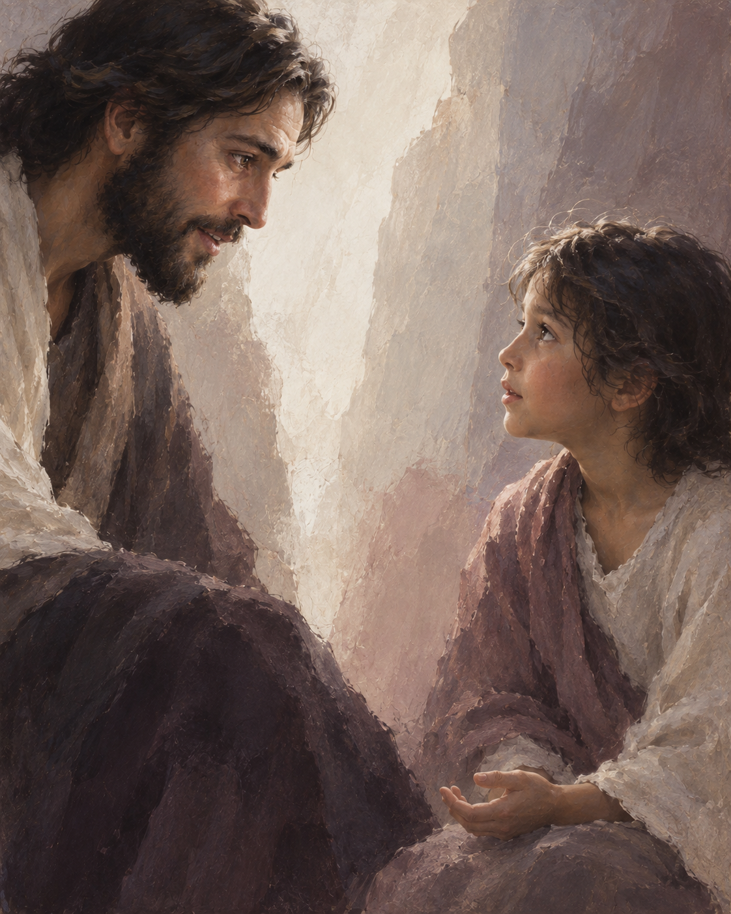
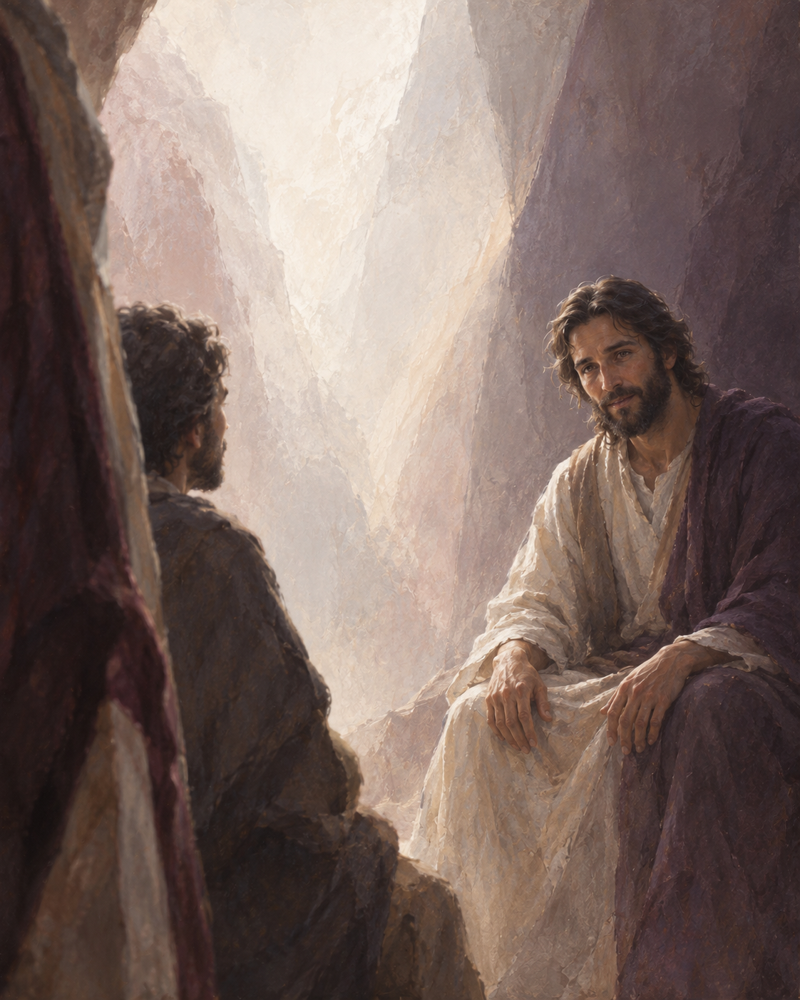

# 2026년 10월 2일 제작 예시

수호천사 기념일, 마태 18,1-5.10. 공식 출처는 evidence.json에 있으며 새 제작 때 날짜별 원문을 다시 확인한다. 이번 신규 생성본은 사용자의 배포 요청으로 동봉한 시안이며 선택·최종 게시 승인은 아직 없다.

## Threads·네이버 블로그 공통 본문

“너희는 이 작은 이들 가운데 하나라도 업신여기지 않도록 주의하여라.”
마태 18,10

예수님께서는 누가 가장 큰지 묻는 제자들 한가운데에 어린이를 세우십니다. 우리가 쉽게 지나치는 사람을 주님은 가운데에 두십니다.

말이 서툴다는 이유로, 나이가 어리다는 이유로 대수롭지 않게 넘긴 이야기는 없었는지 돌아봅니다. 오늘은 말을 마칠 때까지 기다려 주고 싶습니다.

주님, 제가 가볍게 대한 사람을 다시 바라보게 해 주세요.

2026.10.02

## 그림 옵션

### A · 가운데에 선 어린이

### B · 눈을 맞추는 순간

### C · 어린이의 자리에서

## 다른 컴퓨터에서 제작

저장소 루트의 AGENTS.md가 진입 지침이다. 날짜를 공식 자료와 확인한 뒤, 이 날짜의 복음·인용이 일치하면 content.json과 scenes.json을 다시 쓰지 않고 prepare에 그대로 사용한다. 장면 설계·본문 길이가 실행 모델에 따라 달라지는 것을 막기 위해서다. prepare는 현재 v3 참조 두 장과 고정 지시를 포함한 실제 생성 요청 세 개를 만든다. 각 요청을 내장 이미지 도구에 그대로 전달하고 실제 결과를 이 세 장과 비교한다. 불일치하면 보류한다. 다른 날짜에는 해당 날짜를 검증하여 새 content와 scenes를 만든다.

기본 제작은 실제 새 이미지 세 장이다. 동봉 이미지를 새로 생성했다고 주장하지 않는다. 사용자가 이 예시 그대로를 원하면 위의 원본 파일과 post.txt를 제시할 수 있다. 이 경우 재생성이 아니라 저장된 예시를 제공한다고 명시한다. 새 생성은 동일한 입력이어도 픽셀 단위 동일 결과를 보장하지 않는다.

두 채널 기본 본문은 공백·줄바꿈 포함 249자다. 임의로 블로그 설명을 늘리지 않는다. 게시나 카드 최종 승인은 별도다.

실제 검토: 장면 재설계와 열감 완화는 반영됐지만 인물의 사실성과 반복 잔질감이 남아 있다. 이 예시는 제작 입력과 결과를 확인하기 위한 것으로, 목표 미적 완성도 통과나 사용자 최종 승인 사례가 아니다.
