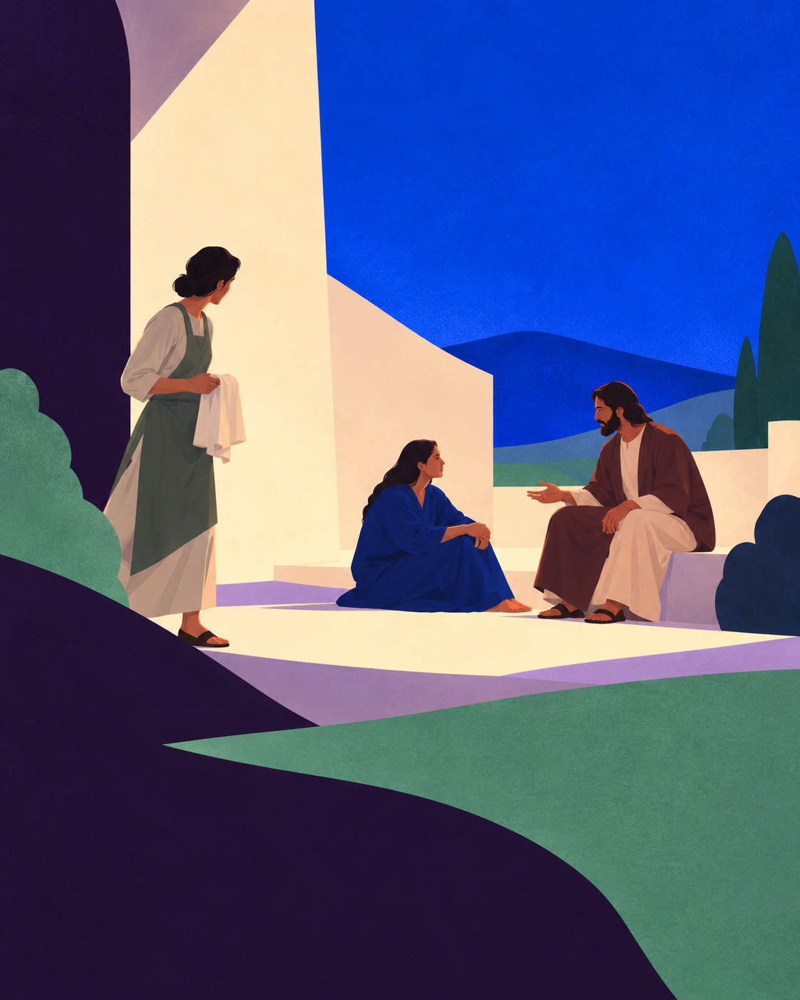
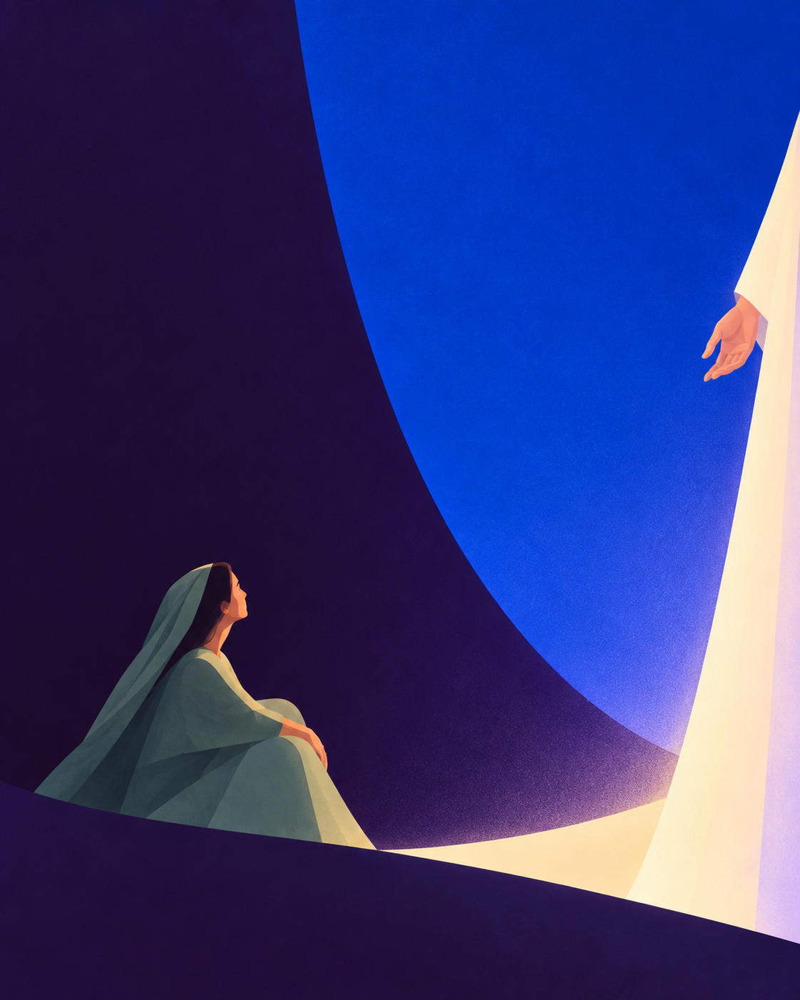
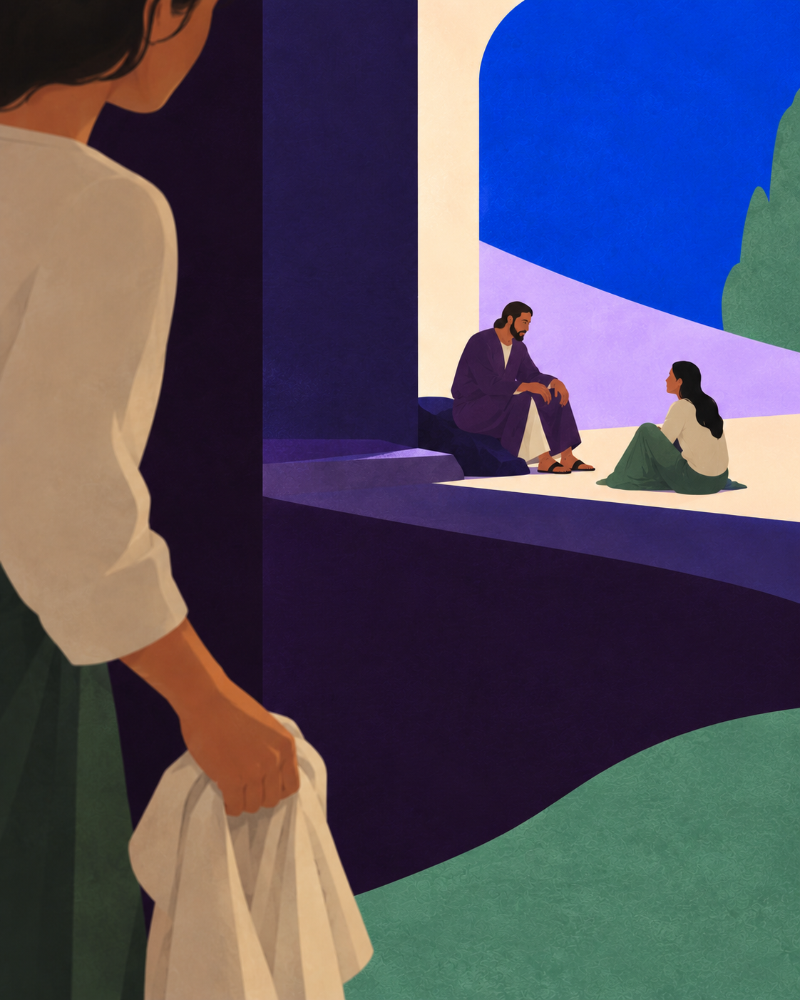

# 2026년 10월 6일 복음 제작 예시

연중 제27주간 화요일, 루카 10,38-42. 인용은 한국천주교주교회의 [해당 날짜 매일미사](https://missa.cbck.or.kr/DailyMissa/20261006)의 42절에서 직접 확인했다. `evidence.json`은 당시의 조회 기록이며 다른 날짜의 검증을 대신하지 않는다.

Threads와 네이버 블로그에 공통으로 쓰는 짧은 본문은 [post.txt](post.txt)에 있다. 공백과 줄바꿈을 포함해 240자다. 직접 인용, 창작 묵상과 기도는 [content.json](content.json)에 분리했다. 전체 복음은 맥락이고 “그러나 필요한 것은 한 가지뿐이다.”가 그림의 초점이다.

## 그림 세 시안

A는 마르타, 마리아와 예수님의 관계가 넓게 읽힌다. 오늘의 기준으로는 다소 설명적인 편이므로, 새 날짜의 A는 이보다 더 덜어낼 수 있다.

B는 현재 단순화 기준이다. 작은 마리아와 일부만 보이는 예수님 사이의 거리, 큰 두 색면과 좁은 빛의 접점만으로 인용문의 관계를 남긴다. 참조해야 할 것은 생략의 정도와 묵상의 여지다. 마리아와 예수님의 위치, 옷, 손짓, 색면 경계를 다른 말씀에 복제하지 않는다.

C는 마르타가 멈추어 바라보는 시점이다. 이 시점의 차이를 참고하되 설명 소품은 새 날짜에서 필요한 만큼만 남긴다.

세 이미지는 실제 신규 생성 원본이며 B는 첫 생성보다 더 단순화해 다시 만든 버전이다. 사용자는 이 두 번째 B의 단순화 방향을 선호한다고 밝혔다. 이는 개별 게시 이미지의 최종 승인이나 실제 게시 기록과 다르다.

2026년 10월 6일 제작을 다시 요청받으면 주교회의와 굿뉴스의 그날 복음·인용을 새로 검증한다. 일치할 때만 이 폴더의 `content.json`과 `scenes.json`을 기본 입력으로 사용한다. 그림은 새로 세 장 생성하고 보존된 예시와 직접 비교한다. 그림이 매번 같은 픽셀이나 같은 미적 품질로 생성된다는 보장은 없으며, 예시 파일 자체를 새 그림처럼 제시하지 않는다.
